# EC2 Instance Deployment Lab

## Lab Objective
To launch and configure an Amazon EC2 instance and establish secure connectivity.

---

## AWS Services Used
- Amazon EC2
- IAM
- Security Groups

---

## Steps Performed

1. Logged into AWS Console
2. Navigated to EC2 Dashboard
3. Launched a new EC2 instance
4. Configured security groups
5. Created key pair
6. Connected to instance using SSH

---

## Challenges Faced
Dealing with EBS Volume for the first time

---

## What I Learned
- How to deploy virtual servers in AWS
- How security groups control traffic
- How key pairs provide secure authentication

---

## Screenshots

STEP 1: Launching an EC2

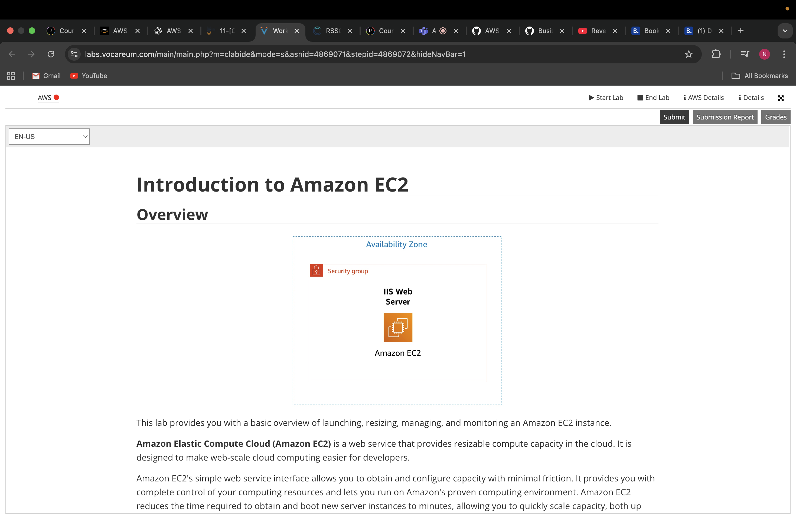

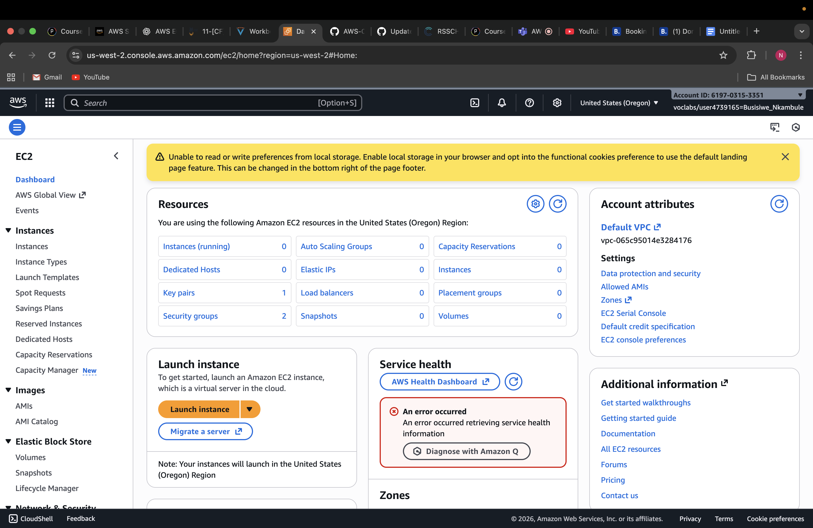

STEP 2: Naming the EC2 instance

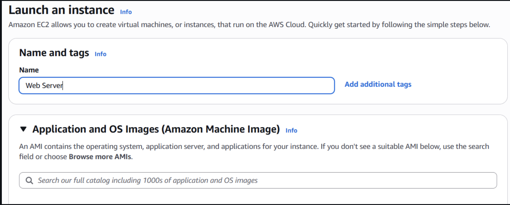

STEP 3: Choosing an Amazon Machine Image(AMI)

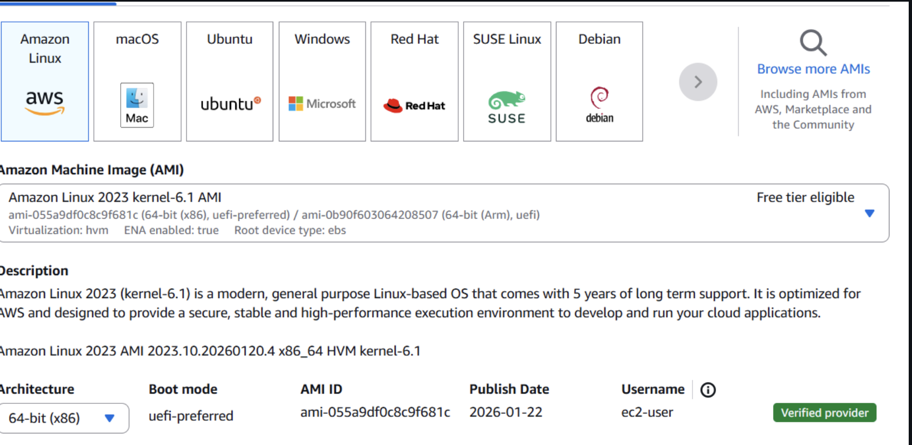

STEP 4: Choose an instance type

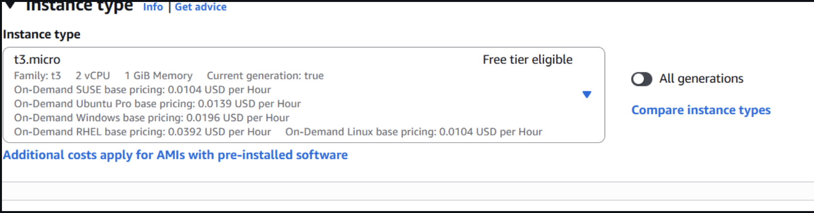

STEP 5: Configuring a key pair

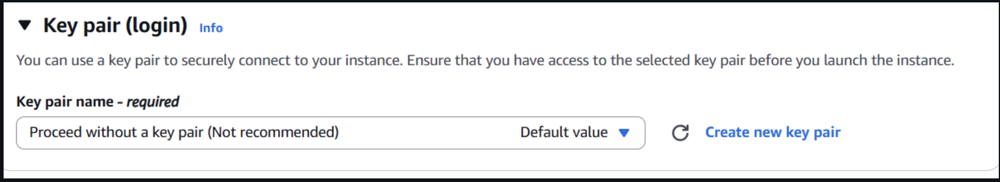

STEP 6: Configuring the network setting

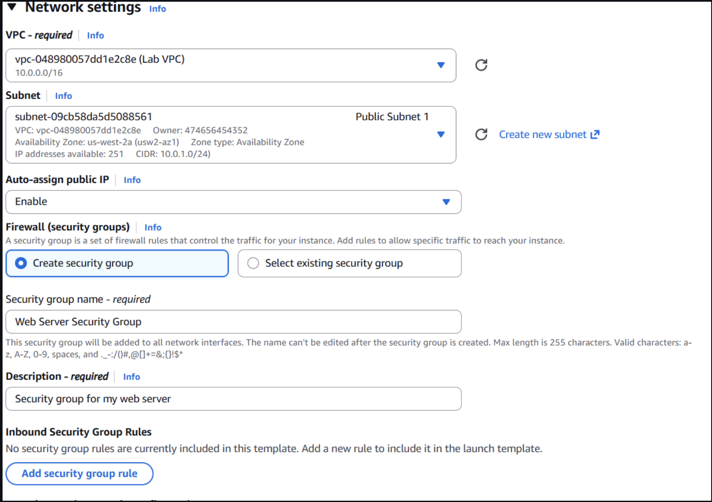

STEP 7: Adding storage

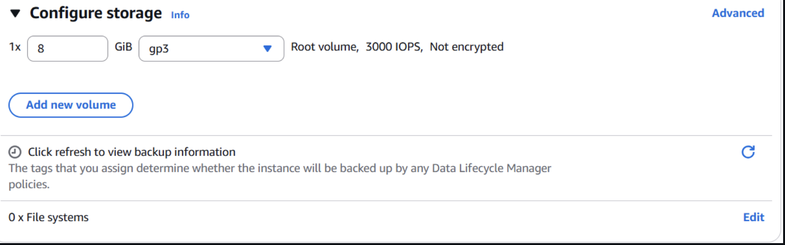

STEP 8: Configuring advanced details

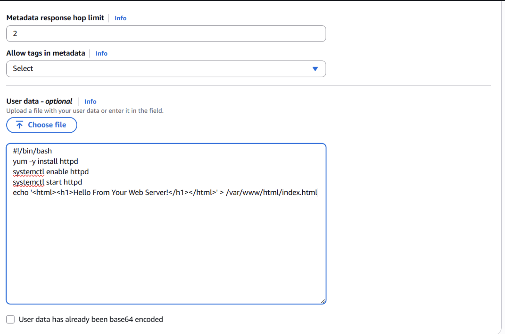

STEP 9: Launching an EC2 instance

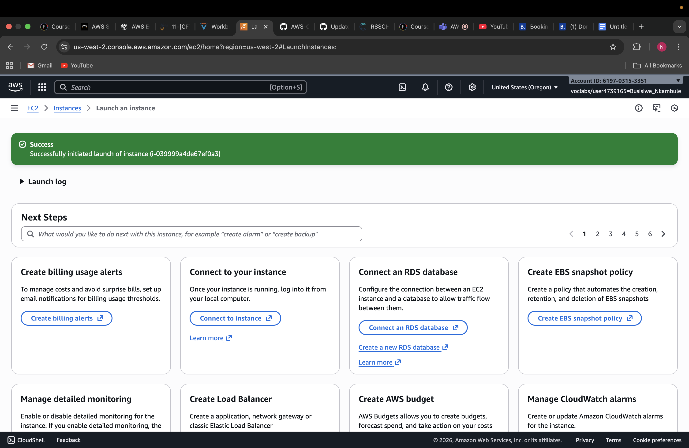

STEP 10: Monitor the instance

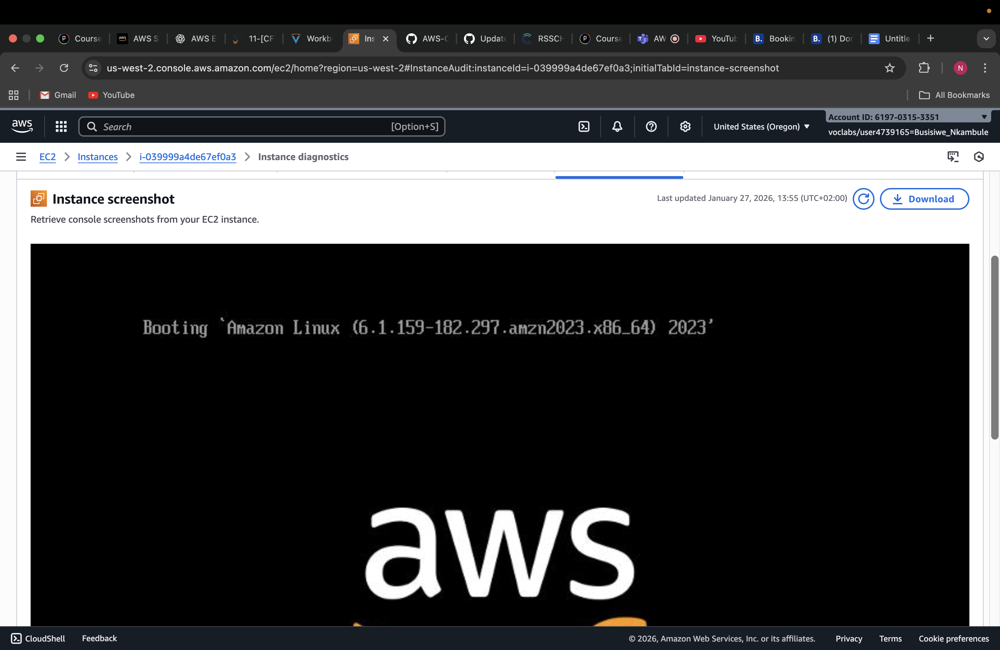

STEP 10: Update the security group and access the web server

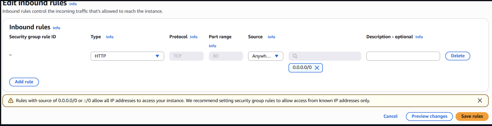

STEP 11: Resize your instance:Instance type and EBS volume

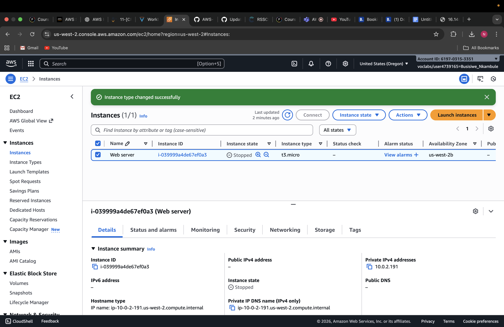

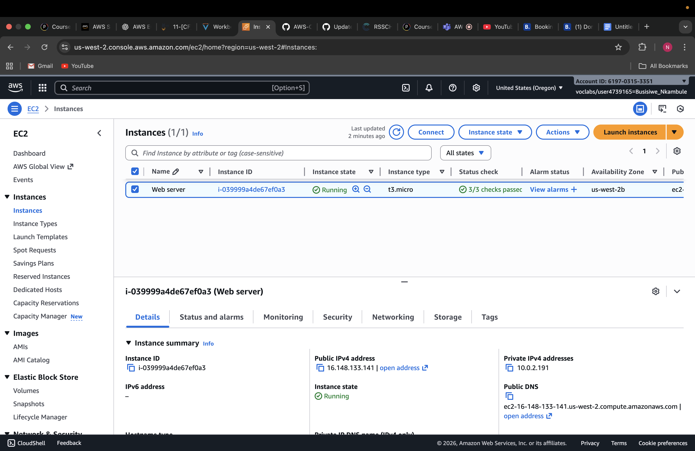

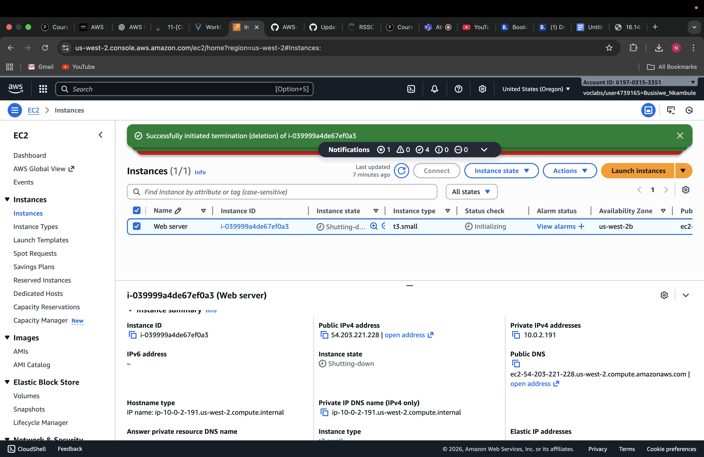

STEP 12: Test termination protection

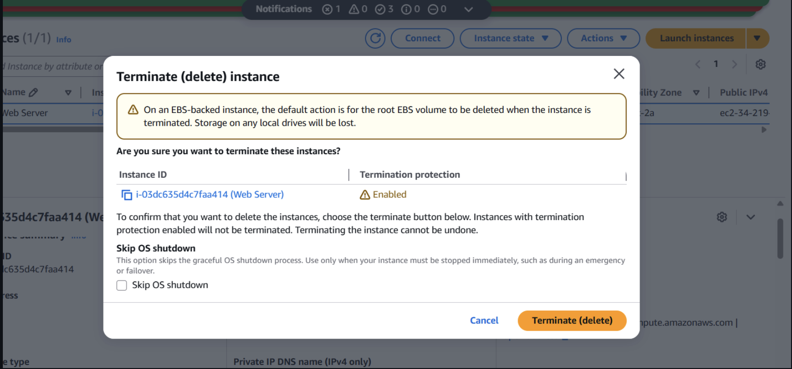

